!SLIDE center

# Git Content Model #
## What does Git "track"? ##

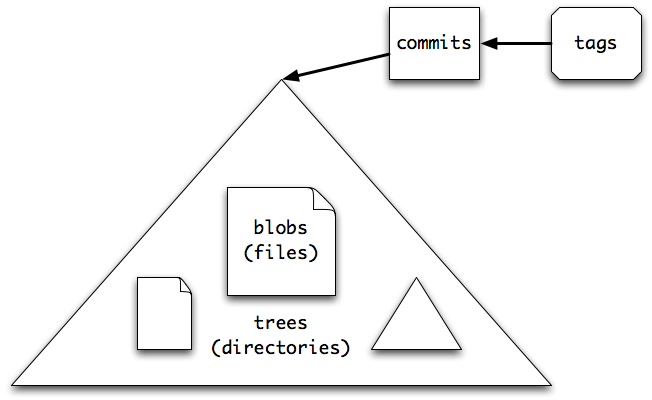

!SLIDE bullets

# Workflow (Local)

* 1 - **Create or edit** content
* 2 - **Add** the content (to the "index")
* 3 - **Commit** (to the "repo")
* 4 - Rinse and Repeat

!SLIDE center

# Workflow (Local)

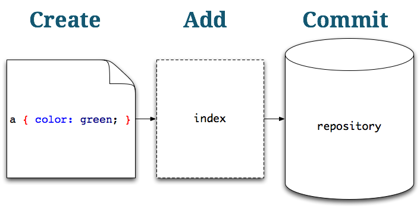

!SLIDE center

# Commits form a history

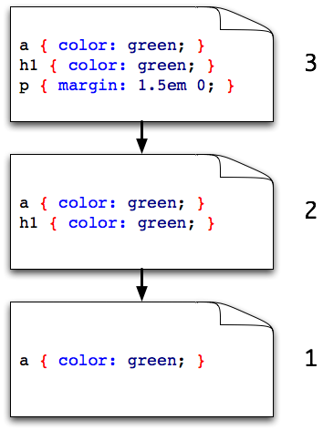

## Each commit: has ID, points to "parent"

!SLIDE center

# Commits happen on a "branch"

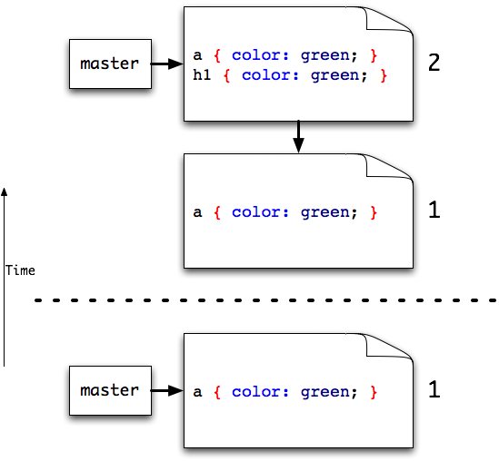

!SLIDE center

# A branch is a pointer

## You control which branch you are "on" when you make a commit

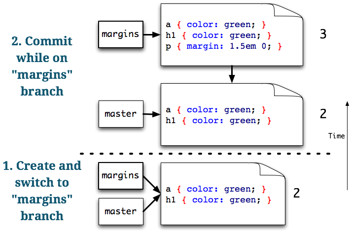

!SLIDE center

# Huh? #
## Wireframing time! ##

!SLIDE center

# Alice's Repo

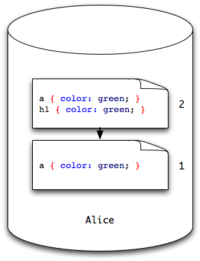

!SLIDE center

# "Push" to a Remote Repo

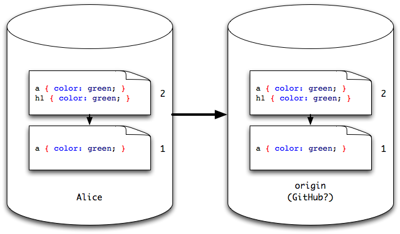

## Collaboration can begin!

!SLIDE center

# "Clone" a Repo

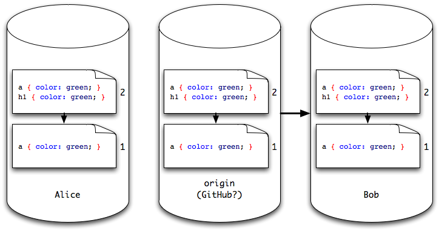

## Gets a full, local copy for the first time

!SLIDE center

# Bob makes a commit

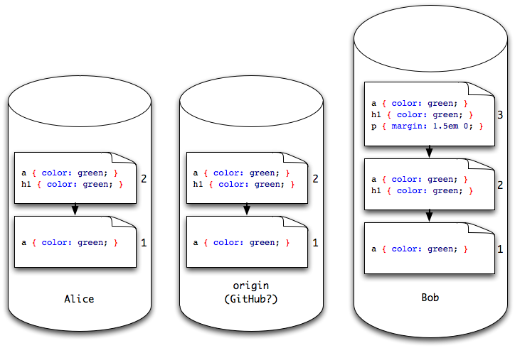

!SLIDE center

# Bob pushes

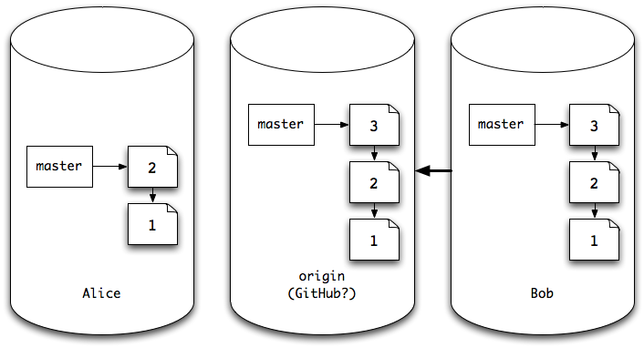

!SLIDE center

# Alice "fetches" to see what's new

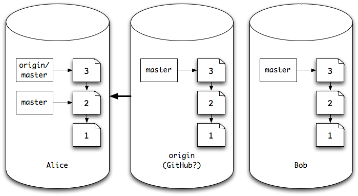

## Fetch the commits I don't have and give me local copies

!SLIDE center

# Alice needs to merge

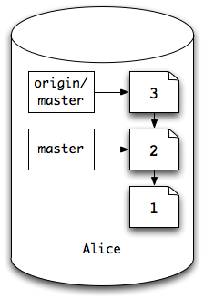

### Merging is a difficult concept to fully grasp
### `origin/master` is a local copy of a remote branch
### `origin/master` is different from my `master`
### Watch the wireframe!

!SLIDE center

# Alice merges

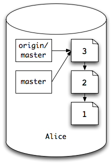

### `origin/master` and `master` are now the same
### Working copy now reflects state given by commit 3
### i.e. the most up to date file

!SLIDE center

# Multiple commits

### State @ commit 3
    
    @@@ css
    a { color: green; }
    h1 { color: green; }
    p { margin: 1.5em 0; }
    
### Alice changes link color

    @@@ css
    a { color: red; }
    h1 { color: green; }
    p { margin: 1.5em 0; }
  
### Bob changes H1 color

    @@@ css
    a { color: green; }
    h1 { color: red; }
    p { margin: 1.5em 0; }

!SLIDE center

# Alice commits and pushes first

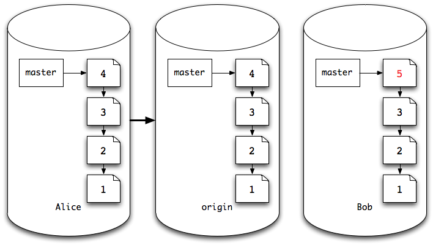

!SLIDE center

# Bob can't push to `origin` `master`

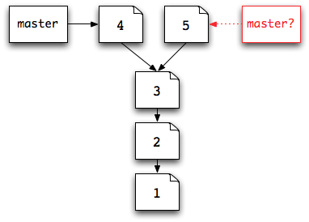

### This is **non-fast forward**
### `master` can't be both the state given by commit 4 AND commit 5
### unless...

!SLIDE center

# Bob fetches, then merges

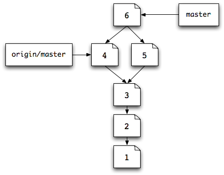

### A "merge commit" is created that reconciles the differences
### A merge commit has 2 parents
### Now he can push - commit 6 is "fast forward" from 4

!SLIDE center

# At this point...
### I'm really hoping the physical wireframing worked...

!SLIDE center

# What else could Bob have done?

!SLIDE center

# Rebase

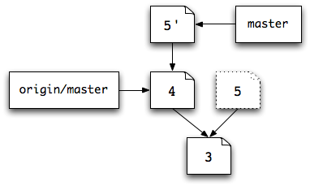

## Rebase commit 5 "on to" commit 4

### 1. Start at commit 4
### 2. Consider the common ancestor (commit 3)
### 3. Take the differences between 5 and the common ancestor
### 4. "Replay" those changes on top of commit 4
### 5. Abandon commit 5. Its now commit 5'

!SLIDE center

# What did we skip?

## Merge conflicts or rebase conflicts

### If more than 1 commit makes a change to the same line, Git can't merge the files
### You have to tell it what to keep

!SLIDE

# Let's do it again
# from the command line

### (I'll update slides later with representative commands)

!SLIDE center

# GitHub for Mac

### [mac.github.com](http://mac.github.com)

## Has 1 button: Sync

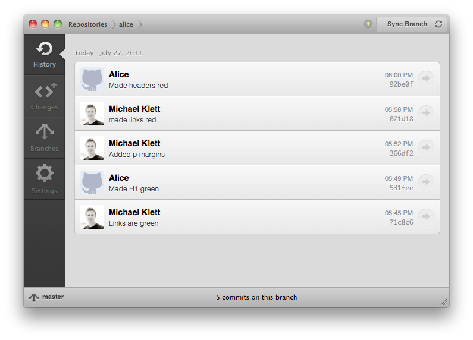

!SLIDE

# GitHub for Mac: Sync

### I was skeptical
### But I think they got it right
### (Especially for our use-case)
### It does a Pull-and-rebase

!SLIDE

# Tips for working on shared Repository

### (i.e. you have commit rights)

## Sync often to keep conflicts smaller
## Commit often

!SLIDE

# Tips for working on a GitHub open-source project

### (i.e. you don't have commit rights)

## Fork the repo in GitHub
## Sync often
## Commit often
## Send pull request as you've synced